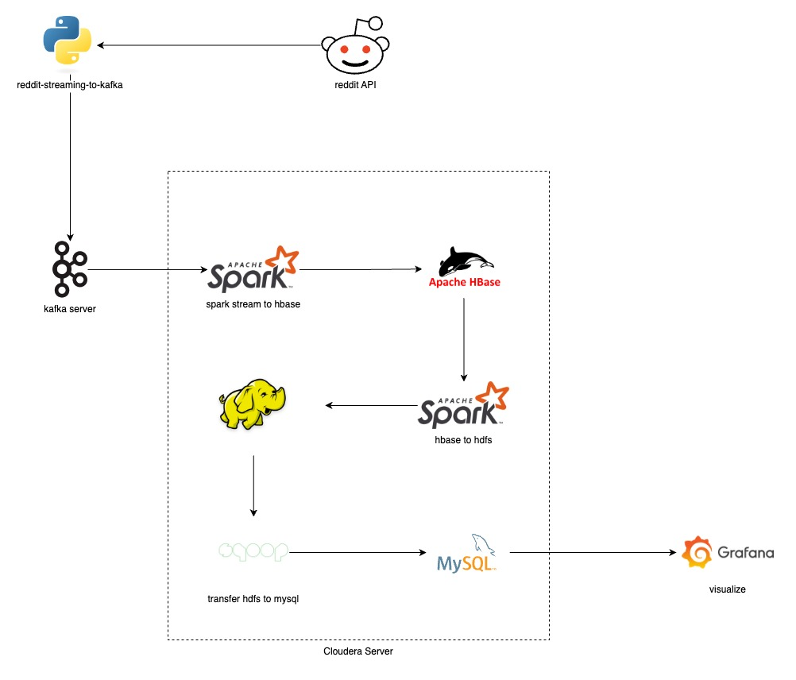
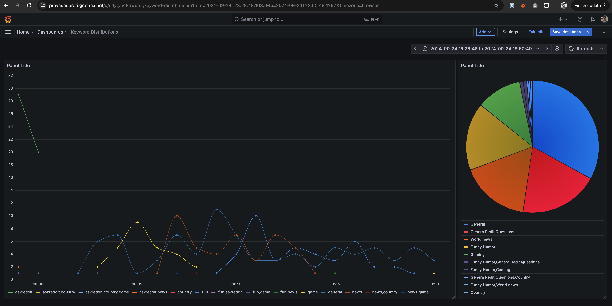

# Big Data Technology Project

### Reddit comment analyzer

This project uses the Reddit API to fetch comments from selected subreddits. The comments are categorized into keywords. Later, the distribution and trends of those keywords are analyzed.

## Architecture



### Explanation of the Architecture

To provide a more detailed explanation of the architecture:

1. The Python script acts as a data fetcher from Reddit. It utilizes the Reddit API to retrieve the desired data, such as comments, posts, or other relevant information. This script is responsible for fetching the data and publishing it to Kafka.

2. Kafka, a distributed streaming platform, serves as a message broker in this architecture. It receives the data published by the Python script and ensures reliable and scalable data transfer between the producer (Python script) and the consumer (Spark Streaming).

3. Spark Streaming, a real-time processing framework, consumes the data from Kafka in micro-batches. It processes the Reddit comments using various transformations and operations to derive keywords. Spark Streaming provides the ability to handle large volumes of data in real-time and perform complex computations efficiently.

4. The processed data is then stored in an HBase database. HBase is a NoSQL database that offers high scalability and fast read/write operations. It is well-suited for storing large amounts of structured or semi-structured data, making it an ideal choice for this architecture.

5. Another Spark SQL job is responsible for fetching the data from HBase and dumping it into HDFS. HDFS, the Hadoop Distributed File System, is a distributed file system designed to store and process large datasets across multiple machines. It provides fault tolerance and high throughput, making it suitable for big data processing.

6. Sqoop, a data transfer tool, is used to export the data from HDFS to MySQL. Sqoop simplifies the process of transferring data between Hadoop and relational databases. It allows for seamless integration between the Hadoop ecosystem and traditional databases like MySQL.

7. Finally, Grafana is used for data visualization. It connects to the MySQL database and runs SQL queries to fetch the final data. Grafana provides a user-friendly interface to create dashboards and visualizations, enabling users to gain insights from the processed data in a visually appealing manner.

This architecture leverages the power of big data technologies to process and analyze data from Reddit, enabling the extraction of valuable insights and facilitating data-driven decision making.

## Setup

### Start Kafka Server

1. Change the directory to the Kafka server by running the following command:

   ```
   cd kafka-server
   ```

2. Start the Kafka server using Docker Compose by running the following command:
   ```
   docker-compose up -d
   ```

These steps will ensure that the Kafka server is up and running, ready to receive and process data in your architecture.

### Stream Reddit Comments to Kafka Server

1. Open a terminal or command prompt.

2. Change the directory to the `reddit-streaming-to-kafka` directory by running the following command:

   ```
   cd reddit-streaming-to-kafka
   ```

3. Create a virtual environment using Python by running the following command:

   ```
   python -m venv venv
   ```

4. Activate the virtual environment. On macOS or Linux, run the following command:

   ```
   source venv/bin/activate
   ```

5. Install the required dependencies by running the following command:

   ```
   pip install -r requirements.txt
   ```

6. Run the `main.py` script by running the following command:

   ```
   python main.py
   ```

### Run Spark Streaming Job

- Change the directory to the `spark-streaming-to-hbase` directory using the command: `cd spark-streaming-to-hbase`

- Open the project in IntelliJ by selecting "Open" from the File menu and navigating to the `spark-streaming-to-hbase` directory.

- Ensure that the Spark job is configured to run in local mode by setting the appropriate configuration properties in the Spark job code or by passing the `--master local` option when running the job.

- To minimize network latency, export the Spark job as a JAR file and run it on the same server where the Cloudera stack is running. Build the project and generate the JAR file using the build tools provided by IntelliJ or by running the appropriate build command in the terminal.

- If you need to update the HBase configuration, modify the `HBaseDBManager.java` file in the `spark-streaming-to-hbase` project. This file contains the necessary code to connect to the HBase database and perform operations on it. Update the appropriate configuration properties, such as the HBase ZooKeeper quorum and port, according to your environment.

```java
public HBaseDBManager() throws IOException
{
     this.hbaseConfig = HBaseConfiguration.create();
     hbaseConfig.set("hbase.zookeeper.quorum", "54.221.154.35"); // HBase server IP where zookeeper is running
     hbaseConfig.set("hbase.zookeeper.property.clientPort", "2181");
     hbaseConfig.set("hbase.rpc.timeout", "60000");
     hbaseConfig.set("hbase.client.retries.number", "3");

     this.DefaultValues();
     this.rowkeyAnalysis=this.GetMaxRownum();
}
```

### Run Spark SQL Job

- Change the directory to the `HbaseToHDFS` directory using the command: `cd HbaseToHDFS`

- Open the project in IntelliJ by selecting "Open" from the File menu and navigating to the `HbaseToHDFS` directory.

- Build the project and generate the JAR file using the build tools provided by IntelliJ or by running the appropriate build command in the terminal.

- Copy the generated JAR file to the Cloudera server where it has access to HBase and HDFS.

- Run the JAR file on the Cloudera server using the appropriate command, specifying the necessary configuration properties and dependencies. For example:

```shell
spark-submit --class com.bdt.HbaseToHDFS --master yarn --deploy-mode cluster --executor-memory 2g --num-executors 4 hbase-to-hdfs.jar
```

Once the Spark SQL job execution is successful, the following files will be generated with part files:

- `hdfs://users/cloudera/CommentResultTable`
- `hdfs://users/cloudera/CommentCountTable`

## Transfer data from hdfs to mysql

Change the directory to the `hdfs-to-mysql` directory using the command:

```shell
cd hdfs-to-mysql
```

Run the bash script run.sh by executing the following command:

```shell
bash run.sh
```

This script will handle the data transfer process from HDFS to MySQL.

## Create grafana user in mysql

Login to mysql

```shell
mysql -u root -pcloudera
```

Run following command inside mysql to create grafana user. This user wil be used in grafana to connect mysql and fetch the data.

```sql
CREATE USER 'grafana'@'%' IDENTIFIED BY 'password';
GRANT ALL PRIVILEGES ON RedditComment.* TO 'grafana'@'%';
FLUSH PRIVILEGES;
```

## Visualize on grafana

create a trend panel using following sql query. It will return a timeserie data.

```sql
SELECT
    time,
    tags,
    COUNT(*) as ""
FROM (
    SELECT
        FROM_UNIXTIME(FLOOR(timestamp / 60) * 60) AS time, tags
        tags
    FROM
        RedditComment.CommentResultTable
) AS inner_query
GROUP BY
    time, tags
ORDER BY
    time;

```

After that add another panel to show the keyword distribution in piechart.

```sql
SELECT * FROM RedditComment.CommentCountTable LIMIT 50
```


